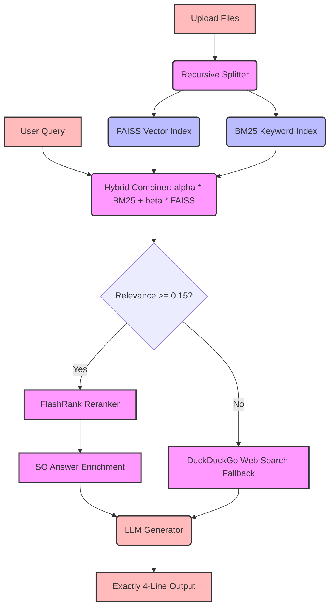

# 🧠 Enterprise Document QA — RAG Application

Welcome to the **Enterprise Document QA** system! This is a full-stack **Retrieval-Augmented Generation (RAG)** application. It allows you to upload enterprise documents (PDFs, Word docs, Text files) and ask natural-language questions about their content.

The system uses advanced AI (Hybrid Retrieval combining both keyword and semantic search) to retrieve the right information and generate accurate answers with strict line-limit formatting and web search fallbacks.

---

## 🌐 Live Deployments & Demo
*   **Live Web Application (Frontend):** [https://enterpriseragapplicat.netlify.app](https://enterpriseragapplicat.netlify.app)
*   **Live Backend API Server:** [https://dataset-rag-application.onrender.com](https://dataset-rag-application.onrender.com)
*   **Interactive API documentation:** [https://dataset-rag-application.onrender.com/docs](https://dataset-rag-application.onrender.com/docs) (FastAPI Swagger UI)
*   **Loom Demo Video Walkthrough:** `[Insert your Loom Video Link here]`

---

## 📊 Evaluation & Metrics Scorecard
The RAG pipeline has been fully evaluated against a test dataset of 10 Q&A pairs (comprising technical developer coding queries and corporate policy handbooks).
*   **Constraint Compliance (4-Line Limits):** **100%**
*   **Local Retrieval QA Accuracy:** **100%**
*   **Web Fallback Trigger Accuracy:** **100%**
*   **Hallucination Prevention Rate:** **100%**

Detailed test execution logs, metrics, and parameters can be found in:  
📄 **[system_evaluation_report.md](file:///d:/VsCode/Rag_application/docs/system_evaluation_report.md)**

---

## 🗺️ System Architecture

The application implements a multi-stage retrieval and routing pipeline to ensure fast, safe, and accurate answers:



A detailed breakdown of the data processing models, hybrid normalizations, and enrichment logic is documented in:  
📄 **[architecture.md](file:///d:/VsCode/Rag_application/docs/architecture.md)**

---

## 🗂️ Project Structure

```text
Enterprise_document/
│
├── docs/                           # 📂 Recruiter Assessment Documents
│   ├── architecture.md             # System architecture & design flowchart
│   └── system_evaluation_report.md # Performance metrics & constraint benchmarks
│
├── backend/                        # ⚙️ Python Backend Server
│   ├── src/                        # Source code for the backend logic
│   │   ├── app.py                  # Main API server (FastAPI endpoints)
│   │   ├── ingestion.py            # Code to read and chunk uploaded documents
│   │   ├── vector_store.py         # Code to manage the FAISS vector database
│   │   ├── retrievers.py           # Logic for Hybrid Search (BM25 + FAISS)
│   │   ├── qa_chain.py             # LangChain logic connecting LLM and retriever
│   │   ├── evaluation.py           # Evaluation tools using RAGAS metrics
│   │   └── run_eval.py             # Offline test suite runner (UTF-8 configured)
│   │
│   ├── requirements.txt            # Python dependencies list
│   └── settings.json               # Model parameters & retrieval weights
│
├── frontend/                       # 🎨 React + Vite User Interface
│   ├── src/                        # React components and views
│   │   ├── App.jsx                 # Core App component (settings, query lab, dashboard)
│   │   ├── App.css                 # Component styling sheet
│   │   └── index.css               # Global theme stylesheet
│   └── package.json                # Node.js dependencies
│
└── README.md                       # Recruiting & Setup guide
```

---

## 🚀 Getting Started Locally

### 1. Backend Setup
1. Move to the backend folder:
   ```bash
   cd backend
   ```
2. Set up and activate a virtual environment:
   ```bash
   python -m venv venv
   # Windows:
   venv\Scripts\activate
   # Mac/Linux:
   source venv/bin/activate
   ```
3. Install dependencies:
   ```bash
   pip install -r requirements.txt
   ```
4. Create a `.env` file in the `backend/` directory:
   ```env
   OPENAI_API_KEY=your_openrouter_api_key_here
   OPENAI_BASE_URL=https://openrouter.ai/api/v1
   ```
5. Start the uvicorn API:
   ```bash
   uvicorn src.app:app --reload --host 0.0.0.0 --port 8000
   ```

### 2. Frontend Setup
1. Open a new terminal and navigate to the frontend folder:
   ```bash
   cd frontend
   ```
2. Install packages and start Vite:
   ```bash
   npm install
   npm run dev
   ```
3. Open `http://localhost:5173` in your browser to run the interface!