# System Architecture & Technical Design

This document details the architecture, data flow, and retrieval strategies utilized in the **Enterprise Document QA** Retrieval-Augmented Generation (RAG) system.

---

## 🗺️ Visual Architecture Flow

The following Mermaid diagram outlines the end-to-end data ingestion and query execution pipelines:

```mermaid
graph TD
    %% Styling
    classDef process fill:#f9f,stroke:#333,stroke-width:2px;
    classDef storage fill:#bbf,stroke:#333,stroke-width:2px;
    classDef external fill:#fbb,stroke:#333,stroke-width:2px;
    
    %% Ingestion Pipeline
    subgraph Ingestion_Pipeline [Ingestion Phase]
        A[Upload PDF/TXT/DOCX/CSV] --> B(Recursive Character Splitter)
        B --> C{Enrichment Type}
        C -- StackOverflow Q&A --> D(Link Answers to Question IDs)
        C -- General Text --> E(Create Text Chunks)
        D --> F(FAISS Embeddings Generator)
        E --> F
        F --> G[(FAISS Vector Index)]
        D --> H(BM25 Tokenizer)
        E --> H
        H --> I[(BM25 JSON Index)]
    end
    
    %% Query Pipeline
    subgraph Query_Pipeline [Query Phase]
        J[User Query Input] --> K(Parallel Retrieval Engine)
        K --> L[FAISS Semantic Search]
        K --> M[BM25 Keyword Search]
        L --> N[L2 Normalization]
        M --> O[Score Normalization]
        N --> P(Hybrid Combiner: alpha * BM25 + beta * Vector)
        O --> P
        P --> Q{Relevance Threshold >= 0.15?}
        
        Q -- Yes --> R[FlashRank Cross-Encoder Reranker]
        R --> S[StackOverflow Answer Enrichment]
        S --> T(LLM Generator)
        
        Q -- No --> U[DuckDuckGo Web Search Fallback]
        U --> V{Web Match Found?}
        V -- Yes --> T
        V -- No --> W[Return Pre-Configured Safe Template]
    end

    %% Apply Styles
    class B,D,E,F,H,K,N,O,P,R,S,U process;
    class G,I storage;
    class J,T,W external;
```

---

## 🛠️ Pipeline Explanations

### 1. Ingestion & Pre-processing Phase
*   **Recursive Splitting:** Document texts are split into overlapping chunks (default size: `1000` characters, overlap: `200` characters) using `RecursiveCharacterTextSplitter` to maintain context across boundaries.
*   **Dual Indexing:** 
    *   **FAISS Vector Index:** Embedding vectors are computed using the `all-MiniLM-L6-v2` transformer and stored locally.
    *   **BM25 Keyword Index:** Text chunks are tokenized and processed via the BM25Okapi algorithm, with metadata and contents saved in a serializable JSON format ([bm25_chunks.json](file:///d:/VsCode/Rag_application/backend/bm25_chunks.json)).

### 2. Parallel Retrieval & Hybrid Scoring
*   **Normalization:** Since BM25 scores (log-probability values) and FAISS vector metrics (L2 Euclidean distances) use different scales, they are normalized:
    *   BM25 scores are normalized relative to the maximum BM25 score of the retrieved corpus.
    *   FAISS scores are inverted and scaled: $1.0 - (\text{score} / \text{max\_score})$ so that higher is better.
*   **Hybrid Combines:** A weighted sum combines the scores:
    $$\text{Score} = \alpha \times \text{BM25}_{\text{norm}} + \beta \times \text{Vector}_{\text{norm}}$$
    This combines keyword precision and semantic meaning.

### 3. Re-ranking & Context Enrichment
*   **FlashRank Reranking:** A lightweight cross-encoder model reranks the top 15 candidate chunks, shifting the most contextually relevant chunks to the absolute top of the context window.
*   **StackOverflow Answer Enrichment:** If the system retrieves a question chunk from the SO dataset, it scans the metadata and appends all matching answer chunks (where `parentid` matches the question `id`) to ensure the LLM receives both the problem description and the solutions.

### 4. Self-Healing Fallback Routing
*   **Web Fallback:** If the best candidate score falls below a threshold ($0.15$), the system triggers the web search fallback using DuckDuckGo to prevent empty or outdated local context issues.
*   **Hallucination Guardrails:** If web search returns no match, the LLM is restricted from hallucinating and instead returns a pre-configured, safe organizational warning response.
